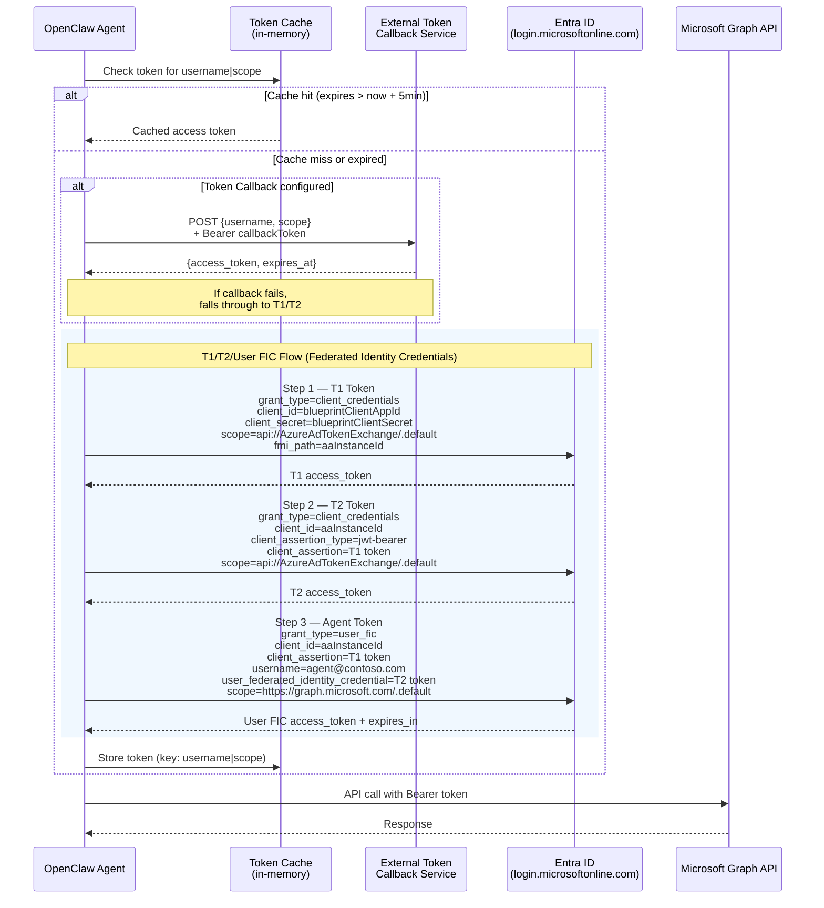

# OpenClaw A365 Channel (alpha)

Native Microsoft 365 Agents (A365) channel for OpenClaw with integrated Graph API tools.

> **Alpha**: This project is under active development. APIs and configuration may change between releases.

## Demo

[](https://youtu.be/7uD2vyfBUUs)

## Features

- **Native A365 Integration**: Receives and sends messages through Microsoft 365 Agents
- **Graph API Tools**: Built-in tools for calendar, email, and user operations
- **Agentic Identity**: Agent has its own user account in the tenant for explicit, auditable access
- **Multi-Model Support**: Configure primary model and fallbacks (Anthropic, OpenAI, OpenRouter, Azure)
- **Network Policy**: Control agent's outbound network access (unrestricted, restricted, or allowlist)
- **Role-Based Access**: Distinguishes between Owner and Requester roles
- **Enterprise-Ready**: Supports single-tenant authentication, allowlists, and DM policies

## Quick Start

### Prerequisites

- Docker
- [Microsoft Agent 365 registration](https://learn.microsoft.com/en-us/microsoft-agent-365/developer/registration) with Agentic User identity
- API key for at least one LLM provider (Anthropic, OpenAI, etc.)
- Access to this repo (for pulling the private image)

### 1. Authenticate with GitHub Container Registry

```bash
# Create a GitHub Personal Access Token with `read:packages` scope
# Then login:
echo YOUR_GITHUB_TOKEN | docker login ghcr.io -u YOUR_GITHUB_USERNAME --password-stdin
```

### 2. Create your config file

Download the example and fill in your credentials:

```bash
curl -O https://raw.githubusercontent.com/SidU/openclaw-a365/main/.env.example
mv .env.example .env
# Edit .env with your credentials
```

Required environment variables:

| Variable | Description |
|----------|-------------|
| `ANTHROPIC_API_KEY` | Anthropic API key (or use another provider) |
| `A365_APP_ID` | Agentic App ID |
| `A365_APP_PASSWORD` | Agentic App Password |
| `A365_TENANT_ID` | Azure AD Tenant ID |
| `AA_INSTANCE_ID` | Autonomous Agent Instance ID |
| `AGENT_IDENTITY` | Agent UPN (e.g., `agent@contoso.com`) |
| `OWNER` | Owner UPN (e.g., `user@contoso.com`) |
| `OWNER_AAD_ID` | Owner's AAD Object ID |

### 3. Run

```bash
docker run --cap-add=NET_ADMIN --env-file .env -p 3978:3978 ghcr.io/sidu/openclaw-a365:latest
```

Or run in background:

```bash
docker run -d --name openclaw-a365 --cap-add=NET_ADMIN --env-file .env -p 3978:3978 ghcr.io/sidu/openclaw-a365:latest
```

> **Note**: `--cap-add=NET_ADMIN` is required for [network policy](#network-policy) enforcement. If you're using `NETWORK_MODE=unrestricted` (default), you can omit it.

### 4. Configure A365

Point your A365 agent to `https://your-host:3978/api/messages`

---

<details>
<summary><b>Alternative: Build from source</b></summary>

If you prefer to build locally instead of using the pre-built image:

```bash
git clone https://github.com/SidU/openclaw-a365.git
cd openclaw-a365
cp .env.example .env
# Edit .env with your credentials
docker-compose up -d
```

</details>

---

## Running without Docker (local dev)

The published Docker image lags upstream openclaw and may not work against the latest gateway. To run from source on a host that already has Node 20+ and pnpm:

```bash
git clone https://github.com/sheilak/openclaw-a365.git
cd openclaw-a365
pnpm install --node-linker=hoisted   # hoisted layout: gateway rejects symlinked plugins
pnpm build                           # tsc -> dist/
pnpm openclaw plugins install . --force
```

Then edit `~/.openclaw/openclaw.json` to add the bits the plugin install doesn't manage. Minimum shape:

```jsonc
{
  "gateway": {
    "mode": "local",
    "auth": { "mode": "token", "token": "<random hex>" }
  },
  "channels": {
    "a365": {
      "enabled": true,
      "appId": "...", "appPassword": "...", "tenantId": "...",
      "agentIdentity": "agent@contoso.onmicrosoft.com",
      "owner": "you@contoso.onmicrosoft.com",
      "ownerAadId": "...",
      "graph": { "aaInstanceId": "..." },
      "webhook": { "port": 3978 },
      "dmPolicy": "pairing"
    }
  },
  "plugins": { "entries": { "a365": { "enabled": true } } }
}
```

If you're using Azure OpenAI / Microsoft Foundry, also add a provider block so the model resolves:

```jsonc
{
  "agents": {
    "defaults": { "model": { "primary": "microsoft-foundry/<deployment>" } }
  },
  "models": {
    "providers": {
      "microsoft-foundry": {
        "baseUrl": "https://<resource>.cognitiveservices.azure.com/openai/v1",
        "models": [{ "id": "<deployment>", "name": "<model-name>" }]
      }
    }
  }
}
```

Set `AZURE_OPENAI_API_KEY` in your environment and start the gateway:

```bash
pnpm openclaw gateway
```

Expose port 3978 with devtunnel (or ngrok) and register the public `/api/messages` URL as your A365 agent's messaging endpoint:

```bash
devtunnel host -p 3978 -a   # -a = anonymous access; required for Bot Framework
```

A `POST /api/messages` with no auth should return `HTTP 401 {"jwt-auth-error":"..."}` — that's the expected response for unauthenticated probes and means the channel is up.

---

## Model Configuration

Configure which LLM model to use via environment variables:

```bash
# Primary model (default: anthropic/claude-opus-4-6)
OPENCLAW_MODEL=anthropic/claude-sonnet-4-20250514

# Fallback models (comma-separated, tried in order if primary fails)
OPENCLAW_FALLBACK_MODELS=openai/gpt-4o,openrouter/anthropic/claude-3-haiku
```

Supported providers:
- **Anthropic**: `anthropic/claude-opus-4-6`, `anthropic/claude-sonnet-4-20250514`
- **OpenAI**: `openai/gpt-4o`, `openai/gpt-4-turbo`
- **OpenRouter**: `openrouter/anthropic/claude-3.5-sonnet`, etc.
- **Azure OpenAI**: `azure/gpt-4o` (requires `AZURE_OPENAI_*` config)

## Network Policy

Control what external network resources the agent can access. Since LLM agents can execute code that makes network requests, you may want to restrict outbound access.

### Modes

| Mode | Description |
|------|-------------|
| `unrestricted` | No restrictions - agent can access any URL (default) |
| `restricted` | Only essential domains: Microsoft (auth, Graph) + your configured LLM provider |
| `allowlist` | Essential domains + custom domains you specify |

### Configuration

```bash
# In your .env file:

# Option 1: No restrictions (default)
NETWORK_MODE=unrestricted

# Option 2: Locked down to essentials only
NETWORK_MODE=restricted

# Option 3: Essentials + specific domains
NETWORK_MODE=allowlist
NETWORK_ALLOWLIST=api.weather.gov,api.github.com,your-api.internal.com
```

### Essential Domains

In `restricted` and `allowlist` modes, these domains are always allowed:

| Domain | Purpose |
|--------|---------|
| `login.microsoftonline.com` | Azure AD authentication |
| `graph.microsoft.com` | Microsoft Graph API (calendar, email) |
| `smba.trafficmanager.net` | Bot Framework message delivery |
| `*.botframework.com` | Bot Framework services |
| Your LLM provider | Auto-detected from API keys (Anthropic, OpenAI, etc.) |

### How It Works

Network policy is enforced via `iptables` at the container level, which catches **all** outbound traffic - including shell commands, curl, wget, or any code the LLM might execute. At container startup:

1. Essential domains are resolved to IP addresses
2. If using `allowlist` mode, your custom domains are also resolved
3. iptables rules are applied to allow only those IPs
4. All other outbound traffic is dropped

> **Future**: Dynamic approval flow where the agent can request access to new domains and the owner can approve/deny via Teams notification (Phase 2).

### Running with Network Policy

When using `restricted` or `allowlist` mode, the container needs the `NET_ADMIN` capability:

```bash
# With docker run:
docker run --cap-add=NET_ADMIN --env-file .env -p 3978:3978 ghcr.io/sidu/openclaw-a365:latest

# docker-compose.yml already includes this capability
```

> **Note**: In `unrestricted` mode (default), `NET_ADMIN` is not required.

## Why Agentic Identity?

> **Learn more**: [Microsoft Agent 365 Identity Documentation](https://learn.microsoft.com/en-us/microsoft-agent-365/developer/identity)

A key design principle of A365 agents is that **agents have their own user identity** in the tenant (e.g., `agent@contoso.com`). This is fundamentally different from traditional "on behalf of user" OAuth flows. Microsoft calls this an "Agentic User" - a specialized identity that functions as a full member of your Microsoft 365 organization.

| Traditional Delegated Access | Agentic Identity |
|------------------------------|------------------|
| Agent acts *as* the user | Agent acts *as itself* |
| Access to everything user can access | Access only to explicitly shared resources |
| User must be online to refresh tokens | Agent operates autonomously 24/7 |
| Audit logs show "user did X via app" | Audit logs show "agent@contoso.com did X" |

### Key Benefits

- **Explicit Consent**: Users share specific resources with the agent (e.g., "share my calendar with agent@contoso.com") just like sharing with a colleague
- **Least Privilege**: Agent only sees what's been explicitly shared, not the user's entire mailbox/files
- **Auditability**: All actions are clearly attributed to the agent's identity in compliance logs
- **Familiar UX**: Uses the same sharing model humans already understand
- **Trust Boundaries**: Clear separation between what the agent can access vs. full user access

This model treats the agent as a trusted assistant with its own identity, rather than a service wearing the user's credentials.

## Authentication

The A365 channel uses **Federated Identity Credentials (FIC)** via the Agentic Blueprint to authenticate as the agent's identity.

### T1/T2/Agent Token Flow



The agent authenticates using its own identity (`AGENT_IDENTITY`), then accesses resources that have been shared with it (e.g., the owner's calendar).

The Agentic credentials (`A365_APP_ID`, `A365_APP_PASSWORD`) are used for both:
1. A365 message authentication
2. Graph API token acquisition (T1/T2 flow for agent identity)

## Graph API Tools

The following tools are available to the LLM when Graph API is configured:

| Tool | Description |
|------|-------------|
| `get_calendar_events` | Get calendar events for a date range |
| `create_calendar_event` | Create a new calendar event |
| `update_calendar_event` | Update an existing event |
| `delete_calendar_event` | Delete a calendar event |
| `find_meeting_times` | Find available times for all attendees |
| `send_email` | Send an email via Microsoft Graph |
| `get_user_info` | Get user profile information |

## Configuration Reference

### Required Settings

| Variable | Description |
|----------|-------------|
| `A365_APP_ID` | Agentic App ID |
| `A365_APP_PASSWORD` | Agentic App Password |
| `A365_TENANT_ID` | Azure AD Tenant ID |
| `AA_INSTANCE_ID` | Autonomous Agent Instance ID (for FIC) |
| `AGENT_IDENTITY` | Agent service account UPN |
| `OWNER` | Owner's email address |
| `OWNER_AAD_ID` | Owner's AAD Object ID |

### Optional Settings

| Variable | Default | Description |
|----------|---------|-------------|
| `OPENCLAW_MODEL` | `anthropic/claude-opus-4-6` | Primary LLM model |
| `OPENCLAW_FALLBACK_MODELS` | - | Comma-separated fallback models |
| `BUSINESS_HOURS_START` | `08:00` | Business hours start |
| `BUSINESS_HOURS_END` | `18:00` | Business hours end |
| `TIMEZONE` | `America/Los_Angeles` | Timezone |
| `DM_POLICY` | `pairing` | DM policy: `open`, `pairing`, `closed` |

### API Keys (at least one required)

| Variable | Description |
|----------|-------------|
| `ANTHROPIC_API_KEY` | Anthropic API key |
| `OPENAI_API_KEY` | OpenAI API key |
| `OPENROUTER_API_KEY` | OpenRouter API key |
| `AZURE_OPENAI_API_KEY` | Azure OpenAI API key |
| `AZURE_OPENAI_ENDPOINT` | Azure OpenAI endpoint URL |

## Identity & Roles

| Property | Description |
|----------|-------------|
| `AGENT_IDENTITY` | The agent's own user account in the tenant (e.g., `agent@contoso.com`). This is a real Entra ID user that resources are shared with. |
| `OWNER` | Email of the person this agent supports (the "principal"). The owner should share their calendar/resources with `AGENT_IDENTITY`. |
| `OWNER_AAD_ID` | AAD Object ID of the owner (for role detection) |

### Setup: Sharing Resources with the Agent

For the agent to access the owner's calendar, the owner must share it:

1. In Outlook, go to Calendar → Share Calendar
2. Add `agent@contoso.com` (the `AGENT_IDENTITY`)
3. Grant appropriate permissions (e.g., "Can view all details" or "Can edit")

This explicit sharing model ensures the agent only accesses what the owner has consciously granted.

### User Roles

When the owner interacts with the agent, they get `UserRole: Owner`. Others get `UserRole: Requester`.

## Architecture

```
┌─────────────────┐    ┌─────────────────┐    ┌─────────────────────────┐
│ Microsoft Teams │───▶│  A365 Service   │───▶│    OpenClaw A365        │
│ Outlook/Email   │    │                 │    │    ┌───────────────┐    │
└─────────────────┘    └─────────────────┘    │    │  Claude/GPT   │    │
                                              │    │               │    │
        ┌─────────────────────────────────────│────│  Graph Tools  │    │
        │                                     │    └───────────────┘    │
        ▼                                     └─────────────────────────┘
   ┌─────────┐
   │ Graph   │  ◄── Agent authenticates as its own identity
   │ API     │      (accesses resources shared with it)
   └─────────┘
```

## License

MIT
